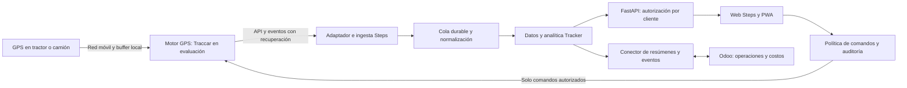

# Plan de producto y desarrollo — Steps Tracker GPS

**Fecha:** 30 de septiembre de 2026.
**Estado:** propuesta técnica y comercial basada en inspección de código, metadatos de Odoo y servicios existentes.
**Objetivo:** convertir Web Tracker en un servicio comercial de monitoreo y gestión de tractores, camiones y otros activos, conectado con Odoo y vendible también a clientes que no usan Odoo.

**Equipo elegido por el usuario para evaluar la compra:** Coban 403A 4G de la publicación `MLC29286152`. La sección 10 incorpora su integración, pruebas y límites; aún no se dispone de una unidad física ni se ha validado el firmware del vendedor.

**Segunda alternativa incorporada:** Coban 401C 4G, publicación `MLC47431452`, oferta `MLC1694435543`. Comparar ambos antes de ampliar la compra; la incorporación del 401C no acredita que sea equivalente o superior al 403A. Véase sección 10.7.

## 1. Decisión propuesta

Desarrollar **Steps Tracker** como un producto con tres piezas coordinadas:

1. **Aplicación web y móvil Steps:** mapa, recorridos, alertas, reportes y experiencia adaptada a cada operación. Evolucionar React/Vite y FastAPI existentes.
2. **Motor de telemetría:** evaluar **Traccar autohospedado** como receptor y gestor de protocolos GPS, detrás de nuestra API, priorizando el Coban 403A 4G y conservando compatibilidad con Teltonika. Adoptarlo si supera la prueba técnica de la fase 0; conservar el receptor Teltonika actual durante la transición.
3. **Módulo Odoo:** evolucionar `step_tracker_odoo` como aplicación de gestión e integración, con extensiones para maquinaria, labores, transporte, mantenimiento y costos.

La propuesta de valor es unir **ubicación y seguridad de flota** con **productividad, mantenimiento y costos de la operación**. Un administrador debe poder pasar de una alerta en el mapa al vehículo, viaje, labor, responsable y centro de costo que la explican.

**Prioridad incorporada por solicitud del usuario:** desarrollar **Steps Protección**, un protocolo antirrobo con detección, atención del incidente e inmovilización autorizada. La detección y gestión se incluyen en el MVP; la actuación física se desarrolla en paralelo y se activa por instalación solo después de homologarla. El cortacorriente ya aparece en la oferta competidora: la diferenciación propuesta es el proceso completo, su evidencia y su integración con la operación agrícola y Odoo.

La entrega inicial debe poder responder: dónde está un equipo, cuándo reportó, qué hizo, qué incidencias tuvo y qué evidencia respalda sus indicadores. La siguiente entrega incorporará cuánto produjo y cuánto costó, según la calidad de los datos disponibles.

Este documento define el desarrollo. Las verificaciones de esta sesión fueron de lectura; no se instalaron módulos ni se modificó la operación GPS.

## 2. Qué contiene realmente la propuesta de la competencia

La evidencia recibida es una **captura de pantalla de `propuestaPiaTorres.pdf`**, no el PDF completo. Se ve la primera página y el comienzo de la segunda. No es posible reconstruir todas las pantallas ni atribuir funciones que no aparecen en la captura.

### Alcance visible

| Oferta visible | Requisito para Steps | Entrega prevista |
|---|---|---|
| Ubicación en tiempo real y mapa de todos los vehículos | Mapa de flota, posición reciente, dirección, velocidad y antigüedad de la señal | MVP comercial |
| Geocercas | Crear zonas; alertar entrada, salida y permanencia según horarios | MVP comercial |
| Corte remoto de motor o energía, según equipo | Steps Protección: incidente, autorización e inmovilización condicionada al hardware y a la instalación | Incidentes en MVP; control en línea prioritaria paralela, con homologación propia |
| Velocidad y alertas de exceso | Límites por vehículo/zona, duración mínima, evidencia y reconocimiento de alerta | MVP comercial |
| Historial y reportes | Viajes, paradas, reproducción, velocidad y exportaciones | MVP comercial |
| Plataforma web y aplicación móvil iOS/Android | Web adaptable y PWA primero; aplicación distribuida en tiendas como fase explícita si se exige esa equivalencia | PWA en MVP; tiendas posterior |
| Panel de estadísticas por vehículo | Indicadores comparables con detalle de sus datos y calidad | MVP + analítica especializada |
| Equipo, instalación, mensualidad y soporte | Alta de dispositivo, instalación, SIM, mantenimiento del servicio y atención al cliente | Parte del producto comercial |

La geocerca delimita una zona y permite detectar eventos; no impide físicamente que un vehículo salga. El servicio debe explicarlo claramente.

### Referencia económica del adjunto

- Equipo GPS más instalación: **CLP 60.000 netos por vehículo**, más IVA según la propuesta.
- Mensualidad: **CLP 3.990 netos por vehículo**; la tabla considera cinco unidades y un total neto de CLP 19.950 mensuales.
- La cotización está fechada el 19/08/2026 y declara una validez de 30 días: es una referencia histórica, no una tarifa vigente confirmada.
- La captura presenta redondeos de IVA; no reutilizar esos importes como fórmula de facturación.
- No quedan confirmados modelo del equipo, propiedad de la SIM, cobertura, retención histórica, API, garantía, soporte presencial, SLA ni naturaleza de la app móvil. Deben compararse antes de concluir equivalencia de precio.

La comparación funcional orientará nuestro alcance. El diseño, código, textos comerciales y marca de Steps serán propios.

## 3. Hallazgo sobre `tracking_manager`

**El módulo encontrado es una herramienta de auditoría de cambios de campos de Odoo. No es un sistema de ubicación GPS.** Su autor es Akretion/OCA, depende de `mail`, declara `application=False` y está clasificado como herramienta. Coincide con la [descripción oficial de OCA](https://raw.githubusercontent.com/OCA/server-tools/18.0/tracking_manager/readme/DESCRIPTION.md).

Se encontró en `/opt/odoo18/custom_addons/tracking_manager`, versión declarada `18.0.1.1.0`. Su configuración se añade a los modelos técnicos: con modo desarrollador, **Ajustes → Técnico → Estructura de la base de datos → Modelos**, seleccionar un modelo y revisar **Custom Tracking / Tracked Fields**. Las etiquetas dependen de la traducción y los permisos. No crea un menú de flota GPS.

### Estado observado en el servidor `odoo-new`

| Base | Estado de `tracking_manager` | Interpretación |
|---|---|---|
| `steps_qa` | `installed` | Instalado como herramienta técnica de seguimiento de cambios |
| `karo_consultorias` | `to install` | Instalación pendiente; no equivale a instalación terminada |
| `SyS` y `STEPS_DEMO_SYS` | `uninstalled` | Disponible en catálogo, sin instalar |

Además, la carpeta encontrada no figura en el `addons_path` observado de `/etc/odoo18.conf`, que utiliza la portada principal. Esto merece revisar la instalación pendiente y el servicio que la originó; no demuestra por sí solo la causa del estado pendiente.

**Acción de fase 0:** confirmar la URL/base usada por el cliente y revisar allí permisos, registro del módulo y operación pendiente. No completar ni cancelar esa instalación como parte automática del proyecto GPS. No hay fundamento para calificar la calidad de `tracking_manager` como GPS: cumple otra función.

## 4. Base existente y brechas comprobadas

### Evidencia revisada

- Rama remota de Web Tracker: `codex/web-tracker-redesign`, commit `9aa55c15a0f3bb3fd28127ea260191ad4632b6e8`, confirmado con el remoto. El checkout principal local está en otra rama; no debe utilizarse como base de una entrega de Tracker sin preparar el entorno correcto.
- [Web Tracker público](https://stepsapp.cl/web_tracker/): HTTP 200; recursos observados `index-BKvnZINA.js` e `index-nOTevwhY.css`. Esto confirma disponibilidad del frontend, no funcionamiento integral con dispositivos reales.
- `tracker-steps-api.service` y `teltonika-ingest.service`: activos durante la inspección.
- API local `/health/capabilities`: estado `ok`, versión `2026.08.20`, capacidades de sincronización Odoo y mantenedores de maestros/partes.
- Receptor activo: `/opt/teltonika-ingest/teltonika_ingest.py`. La inspección de su código encontró soporte solo para **Codec 8**, omisión de los elementos de entrada/salida de sensores y lectura del CRC sin validarlo. No se comprobó recepción reciente desde una SIM real.
- `step_tracker_odoo` está instalado en `LAB_TAREAS`, `STEPS_DEMO` y `CERRO_EL_PLOMO`; en `karo_consultorias` figura sin instalar. Tenerlo instalado no confirma que su sincronización esté configurada o funcionando.

### Qué reutilizar y qué desarrollar

| Componente actual | Valor reutilizable | Trabajo necesario |
|---|---|---|
| React/Vite, mapas y componentes de recorridos | Interfaz y lenguaje visual Steps | Separar estado/proveedores, revisar rendimiento y completar monitoreo continuo |
| Laboratorio demo y fixtures | Demostraciones sin depender de una SIM | Demo aislada, etiquetada y reproducible; producción debe abrir en datos reales |
| FastAPI y PostgreSQL | API, autenticación, maestros, sesiones y partes | Aislamiento por cliente, dispositivos, eventos, flujo en vivo y contratos versionados |
| Sesiones y puntos GPS | Histórico y relación con trabajos | Ingesta continua independiente de que alguien abra una sesión; derivar viajes y trabajos |
| Maestros de máquinas, operadores, predios e implementos | Contexto agrícola existente | Identificadores estables y asignaciones con vigencia temporal |
| Receptor Teltonika | Prueba de conectividad ya construida | Sustituirlo o endurecerlo; probar Codec 8E, sensores, validaciones y recuperación |
| `step_tracker_odoo` / integración en `step_hr` | Enlaces a flota, empleados, analítica y sincronización | Resolver propiedad de modelos, permisos, migración y sincronización incremental |
| `step.machinery.tracking` | Modelo básico de nombre/fecha/compañía | No constituye por sí solo una plataforma telemática |

### Brechas que bloquean la venta a varios clientes

1. Los modelos revisados de máquinas y puntos no tienen una frontera explícita `tenant_id`. Los permisos por centro de costo no sustituyen el aislamiento entre clientes independientes.
2. Hay declaraciones de modelos `step.tracker.*` en `step_hr` y en `step_tracker_odoo` dentro del código disponible. Auditar cuál es propietaria de cada tabla, XML ID y cron en cada instalación antes de moverlos.
3. Las ACL revisadas del módulo Odoo otorgan accesos a `base.group_user`; no se encontraron reglas por compañía en sus archivos de seguridad revisados. Hay que verificar también reglas externas de la base. No se realizó una prueba de exposición de datos.
4. La sincronización actual consulta sesiones recientes con límite: no debe convertirse en el mecanismo de recuperación de una flota con miles de viajes. Necesita cursor, paginación, idempotencia y reconciliación.
5. El receptor actual descarta las señales necesarias para varias analíticas: ignición, tensión, entradas digitales y otros sensores. Estar detenido no permite deducir motor encendido. Además, su decodificador Codec 8 no recibe directamente el protocolo Coban: comprar el 403A exige incorporar esa vía de ingesta.
6. El frontend revisado inicia `demoMode=true` y combina lógica demo/real en `OperationsWorkspace.tsx`. El modo de cliente y el de demostración deben distinguirse desde la entrada.
7. Servicio activo y HTTP 200 no prueban entrega de telemetría, precisión de indicadores ni continuidad operativa. El piloto con hardware es una condición de salida.

## 5. Producto objetivo

### Perfiles de cliente

- **Agrícola:** tractores y maquinaria por fundo/cuartel, labores, implementos, utilización, horas y mantenimiento.
- **Transporte:** camiones y vehículos de apoyo, viajes, detenciones, llegada/salida, utilización y costos por recorrido.
- **Flota mixta:** una operación con ambos perfiles, sin obligar a usar indicadores agrícolas en un camión ni kilómetros como único indicador de un tractor.

### Experiencia principal

| Pantalla | Pregunta que responde | Controles y contenido |
|---|---|---|
| Resumen | ¿Qué requiere atención hoy? | Equipos sin señal, incidencias, actividad y comparación con período anterior |
| Mapa en vivo | ¿Dónde está cada equipo y qué sabemos de su estado? | Toda la flota inicialmente, filtros, agrupación de marcadores y detalle lateral |
| Recorridos | ¿Qué ocurrió en este período? | Viajes, paradas, línea de tiempo, reproducción y gráfico de velocidad sincronizados |
| Alertas | ¿Qué pasó, quién lo atendió y cómo terminó? | Severidad, responsable, reconocimiento, evidencia y cierre |
| Protección | ¿Hay una situación sospechosa y cómo responder? | Armado, incidente, contactos, autorización, estado comprobable de inmovilización y recuperación |
| Geocercas | ¿Qué zonas y horarios debemos controlar? | Polígonos/círculos, versiones, vehículos asociados y reglas |
| Analítica | ¿Dónde se pierde tiempo o capacidad? | KPIs, tendencias, comparación por tipo de activo y navegación al detalle |
| Equipos y dispositivos | ¿Qué está instalado y en qué estado? | Activo, GPS, SIM, instalación, sensores, asignaciones e historial |
| Odoo | ¿Cómo afecta la operación al negocio? | OT, labores, transporte, mantenimiento, centros de costo y conciliación |

Mantener colores, tipografía y patrones de Steps. El mapa debe dominar el monitoreo; los datos y acciones deben seguir siendo legibles en teléfono. Incluir navegación por teclado, contraste, estados de carga/error y tablas alternativas a gráficos.

**Estados del mapa:** movimiento, detenido, ralentí confirmado, motor apagado confirmado, sin señal reciente y estado desconocido. Mostrar siempre hora del último dato y su calidad. No animar una posición antigua como si fuera actual ni convertir falta de cobertura en una parada.

### Alcance inicial vendible

Mapa de flota, ficha por vehículo, alta de GPS, viajes/paradas, historial, geocercas, exceso de velocidad, desconexión, reportes, usuarios/roles, clientes aislados, PWA y operación de soporte. La captura debe continuar aunque el usuario cierre la aplicación o Odoo esté fuera de servicio.

Incluir armado por vehículo/horario y gestión de incidentes antirrobo según la sección 10.6. Mostrar la capacidad de inmovilización como disponible únicamente en instalaciones aprobadas; mientras no esté homologada, ofrecer detección y seguimiento con su alcance explícito.

La PWA permite reutilizar la web en móviles; se probará en Android e iPhone reales. El soporte de notificaciones tiene condiciones de plataforma: WebKit documenta Web Push para aplicaciones añadidas a la pantalla de inicio en iOS/iPadOS desde 16.4. No prometer una app nativa publicada en tiendas al entregar solo una PWA. [Fuente WebKit](https://webkit.org/blog/13878/web-push-for-web-apps-on-ios-and-ipados/).

### 5.1 Rediseño de la experiencia Steps

Desarrollar el rediseño en React/Vite sobre la rama de trabajo indicada, conservando la identidad observada: verde profundo `#123c33`, acento lima `#d8ff62`, tipografía del sistema, superficies claras y controles redondeados. Usar el modelo de desarrollo para explorar y revisar alternativas; el layout no depende de incorporar IA en producción ni de contratar una API de IA.

**Dos vistas complementarias:**

- **Operación en mapa:** navegación compacta, buscador/filtros, lista de flota y mapa dominante. Al seleccionar un activo, abrir detalle contextual con última señal, calidad, actividad, hardware y Protección. Evitar apilar paneles de métricas antes del mapa.
- **Control de flota:** tabla para comparar vehículos, con columnas seleccionables, ordenación y vistas guardadas. Mismos filtros, permisos y selección que el mapa; al cambiar de vista no perder contexto.

| Área | Diseño propuesto | Aceptación |
|---|---|---|
| Navegación | Operación, Recorridos, Protección, Analítica y Equipos; contexto de organización visible | Recorrido principal comprensible sin menús técnicos |
| Cabecera | Título, ámbito/filtros activos y señal de frescura; indicadores compactos configurables | Distinguir totales de flota de resultados filtrados |
| Filtros | Búsqueda por nombre/patente, tipo de activo, fundo/centro de costo, estado, antigüedad de señal, protección y dispositivo | Filtros combinables, limpiar, recuento y estado vacío claro |
| Preferencias | Guardar vista por usuario/cliente, elegir columnas e indicadores, restablecer valores | No ocultar frescura/calidad en detalle ni crear permisos mediante preferencias |
| Tabla | Predeterminadas: activo, tipo, estado, última señal y protección; opcionales: alta, modelo, ACC, responsable, horas/distancia cuando existan | Etiquetas diferenciadas para fecha de alta, captura GPS y recepción; no llamar «última modificación» a la última señal |
| Detalle | Pestañas de actividad, datos y protección; acciones según capacidades del equipo | Cambiar de vehículo no mezcla datos; capacidades ausentes se explican |
| Protección | Incidente y estado del comando separados; solicitud y aprobación con contexto | Ninguna acción física desde una tarjeta genérica ni desde el prototipo visual |
| Móvil | Alternar mapa/lista, filtros en panel y detalle inferior; acciones táctiles de al menos 44 px | Sin desbordamiento a 360 px; permisos y frescura iguales al escritorio |
| Accesibilidad | Contraste, foco visible, etiquetas de estado además de color y navegación por teclado | Flujos principales usables sin ratón; estados de carga/error/sin datos probados |

Preparar una propuesta interactiva con datos sintéticos y alternativas de composición antes de cambiar la aplicación. No presentar esa propuesta como software conectado al GPS. Implementar después por componentes: estructura y navegación → lista/filtros → mapa/detalle → Protección → tabla/personalización → móvil y estados de error.

**Conservación de contexto:** preferencias versionadas por usuario y cliente; filtros compartibles sin incluir credenciales ni datos sensibles. Separar filtros temporales de una vista guardada. La visibilidad por rol se impone en servidor.

## 6. Arquitectura propuesta y decisión del motor GPS

### Opciones

| Opción | Ventaja | Costo/riesgo | Decisión propuesta |
|---|---|---|---|
| Ampliar nuestro receptor Teltonika | Continuidad y control directo del código | Añadir un decodificador Coban y mantener protocolos, sensores, comandos y firmware | Alternativa si la evaluación justifica ese costo adicional |
| Traccar + API y aplicación Steps | Reutiliza recepción y capacidades GPS, conservando nuestro producto | Nuevo componente a operar; adaptar permisos, eventos y versiones | **Preferida para la prueba de fase 0** |
| Procesar todos los puntos dentro de Odoo | Menos componentes aparentes | Acopla alto volumen GPS con transacciones ERP y despliegues de Odoo | No recomendada para la plataforma comercial |

Traccar documenta receptores de protocolos, una API REST, actualizaciones por WebSocket y comandos cuyo soporte depende del protocolo. Hay un catálogo de dispositivos compatibles; estar en ese catálogo no certifica todos los sensores ni el comando requerido para una instalación concreta. [Arquitectura](https://www.traccar.org/architecture/), [API](https://www.traccar.org/traccar-api/), [dispositivos](https://www.traccar.org/devices/), [comandos](https://www.traccar.org/commands/).

La recomendación arquitectónica siguiente es una decisión propuesta para Steps, no una característica instalada actualmente. Revisar versión fijada, dependencias, avisos y licencia al incorporar el motor; el repositorio Traccar declara Apache 2.0. [Licencia del repositorio](https://github.com/traccar/traccar/blob/master/LICENSE.txt).



### Fronteras y responsabilidades

- **Motor GPS:** comunicación con equipos, decodificación, posiciones originales y eventos propios del dispositivo. Acceso administrativo privado.
- **Adaptador:** obtiene cambios, normaliza unidades, relaciona el dispositivo con su cliente y escribe de forma idempotente. WebSocket acelera la entrega; recuperación por API/cursor cubre desconexiones. No asumir que un socket constituye una cola durable.
- **Tracker:** mantiene el modelo normalizado para consulta y analítica, asociaciones operacionales, usuarios, permisos y reglas de negocio. PostgreSQL con PostGIS es la propuesta inicial; particiones temporales según medición.
- **FastAPI:** es la frontera pública de Steps. El navegador nunca recibe una credencial administrativa global del motor ni puede elegir libremente el cliente de una consulta.
- **Odoo:** conserva maestros empresariales, OT, mantenimiento y costos. Recibe resúmenes y eventos pertinentes, sin copiar cada punto GPS al ORM.
- **Notificaciones:** un servicio central Steps registra intentos, entregas y errores. Reintentos con límites, deduplicación, horarios y escalamiento.

Al adoptar Traccar, sus posiciones originales serán la fuente técnica de captura y Tracker mantendrá una proyección normalizada identificada por origen e ID. No habrá dos receptores activos creando viajes independientes para un mismo dispositivo. El puente utilizará API soportada, no escritura directa en tablas internas de Traccar.

Para evitar alertas duplicadas, asignar un único productor a cada regla: eventos GPS básicos desde el motor; reglas de productividad y costos desde Steps. Un catálogo versionado mapeará identificadores de reglas/geocercas y distinguirá eventos originales de derivados. Las notificaciones al usuario se emiten una sola vez desde Steps.

### Contratos propuestos

API nueva bajo `/v1`, manteniendo los contratos actuales mediante compatibilidad temporal:

- `/assets`, `/devices`, `/device-assignments`, `/geofences`.
- `/fleet/snapshot` y canal de actualizaciones autorizado por cliente.
- `/trips`, `/trips/{id}/track`, `/events`, `/alerts`.
- `/analytics/utilization`, `/analytics/agro`, `/reports/jobs`.
- `/integrations/odoo/changes?cursor=...`.
- `/security/incidents` y `/security/arming-policies` para el protocolo antirrobo.
- `/commands` con solicitud, aprobación y consulta de resultado; ejecución habilitada solo para instalaciones homologadas conforme a la sección 10.6.

Paginación estable, unidades documentadas, filtros con el mismo significado en mapa/KPI/reporte y trabajos asíncronos para exportaciones grandes. El backend verifica propiedad y permisos de cada ID, incluso cuando se accede directamente a un detalle o una descarga.

## 7. Datos, dispositivos y calidad

### Modelo mínimo

| Entidad | Datos clave |
|---|---|
| Cliente (`tenant`) | Identificador global, plan, zona horaria y política de retención |
| Activo | Tipo, nombre, patente/identificador, características y vínculos con Odoo |
| Dispositivo | Proveedor, modelo, firmware, protocolo, capacidades, SIM e instalación |
| Asignación | Dispositivo ↔ activo ↔ cliente, desde/hasta; historial conservado |
| Posición | Origen/ID, cliente, activo, instante del dispositivo, recepción, coordenadas, velocidad y calidad |
| Telemetría | Contacto ACC, motor funcionando cuando se pueda confirmar, RPM, batería, alimentación, odómetro, combustible, temperatura y señales disponibles |
| Viaje / sesión de trabajo | Segmentos derivados, paradas, trabajo, traslado y revisión humana |
| Regla / evento / alerta | Condición versionada, evidencia, severidad, responsable y estado |
| Agregado | Período, dimensión, métrica, unidad, algoritmo y calidad |
| Vínculo Odoo | Instancia/base identificada de forma estable, compañía, modelo e ID externo |
| Comando | Solicitante, autorización, destino, vencimiento, respuesta y resultado comprobado |
| Incidente de protección | Activo/cliente, eventos correlacionados, evidencia, responsables, notificaciones, comandos vinculados y resolución |

`tenant_id` debe proceder de una asociación validada por el servidor. Un `company_id=1` de Odoo no es único entre bases: la clave de integración debe incluir instancia/base y compañía.

### Reglas de captura y cálculo

1. Guardar timestamps en UTC y presentar en la zona del cliente, inicialmente `America/Santiago`. Probar cambios de horario.
2. Separar `recorded_at`, `received_at` y `processed_at`; datos recuperados después de una caída deben conservar su fecha real.
3. Tratar el IMEI como identificador, no como secreto de autenticación. Usar provisionamiento, controles de red y las medidas que admita el hardware; no afirmar que todos los GPS soportan TLS.
4. Validar tamaños de paquetes, CRC cuando aplique, coordenadas, orden, duplicados, saltos, velocidad físicamente plausible y reloj desviado.
5. Distinguir dato original, descartado para cálculo, estimado y corregido. Una mala muestra no debe desaparecer sin trazabilidad.
6. La deduplicación usará ID de origen y, cuando no exista, una clave estable que conserve eventos distintos del mismo instante. Diseñar para entrega al menos una vez e idempotencia, sin prometer entrega exactamente una vez.
7. Confirmar paquetes solo después de aceptación durable conforme al protocolo; probar reinicio, caída de API y retransmisión.
8. Interrumpir integración de distancia/tiempo ante gaps excesivos; no dibujar una recta que invente trabajo realizado durante horas sin cobertura.
9. Mantener el recorrido original. El ajuste a calles es una vista derivada para transporte; no aplicarlo a pasadas agrícolas.
10. Corregir agregados cuando lleguen puntos atrasados y reconciliar períodos ya enviados a Odoo mediante versiones.

## 8. Analíticas que diferencian a Steps

Cada indicador debe mostrar período, universo filtrado, unidad, definición, fuente y calidad; permitir abrir los viajes o sesiones que lo componen.

| Indicador | Definición y requisito |
|---|---|
| Distancia | Odómetro validado del equipo/CAN o suma de segmentos GPS válidos; indicar método y no unir gaps arbitrariamente |
| Horas de contacto | Intervalos con ACC activo; indicar conexión y origen. No presentarlas automáticamente como horas de motor |
| Horas de motor | Intervalos con funcionamiento confirmado por RPM, alternador u otra señal validada; marcar desconocidos y limitar gaps |
| Movimiento | Intervalos sobre umbral con permanencia/histéresis para evitar cambios por ruido |
| Ralentí | Motor encendido confirmado y sin movimiento durante un tiempo mínimo; no inferirlo solo de velocidad cero |
| Utilización | Tiempo operativo válido / tiempo programado elegible; con turnos, exclusiones y disponibilidad de señal explícitos |
| Velocidad media | Distancia / tiempo correspondiente; separar media de viaje y media en movimiento |
| Excesos | Tiempo y eventos sobre el límite configurado; mostrar evidencia y criterio de agrupación |
| Cobertura agrícola | Unión de franjas recorridas mientras existe señal de trabajo, usando ancho del implemento, recortada al cuartel y descontando superposición |
| Hectáreas/hora | Área efectivamente cubierta estimada / horas de trabajo válidas; no distancia total multiplicada por ancho sin correcciones |
| Combustible | Lectura de sensor/CAN calibrada; en su ausencia estimación explícita por L/h o km/L, separada del combustible medido |
| Costo/hora, km o hectárea | Costos conciliados de maquinaria, personal e insumos divididos por magnitud validada; evitar duplicar partidas de Odoo |
| Camiones | Tiempo en carga/descarga, espera, cumplimiento de ventana, ruta y costo/viaje; necesita destinos y órdenes asociados |
| Km con/sin carga | Requiere orden o señal de carga; la posición GPS por sí sola no determina la carga |
| Mantenimiento | Vencimientos por fecha, km u horas, con lectura base y calibraciones auditadas |

**Precisión agrícola:** el área calculada con GPS convencional es una estimación. No prometer precisión centimétrica ni control de surcos. Para esa oferta se necesita GNSS/RTK, implemento identificado y validación de campo. Calcular áreas en un sistema métrico apropiado a la zona; no sobre grados de latitud/longitud.

La asignación automática a una labor será inicialmente una sugerencia que el supervisor pueda confirmar. Posición dentro de un cuartel y motor encendido no prueban ejecución de una labor. Combinar OT, horario, implemento, PTO/entrada digital y revisión humana según disponibilidad.

Una eventual capa de IA para explicar variaciones queda después de validar estos cálculos. No es requisito del MVP ni debe inventar causas, reemplazar evidencia o ejecutar comandos sobre vehículos.

## 9. Módulo Odoo y responsabilidades empresariales

### Estructura propuesta

- **`step_tracker_odoo`:** mantener el nombre técnico existente y evolucionarlo como aplicación principal Steps Tracker: activos vinculados, dispositivos, estados, viajes resumidos, alertas y estado de integración.
- **`step_tracker_agro` — nuevo, opcional:** relación con maquinaria, labores, implementos, predios/cuarteles, centros de costo y OT.
- **`step_tracker_transport` — nuevo, opcional:** relación con flota y los módulos de fletes/movilización realmente instalados en cada cliente.
- **Facturación del servicio:** integrar con las capacidades comerciales disponibles en cada Odoo; no asumir que todos tienen el mismo módulo de suscripciones o edición.

Mantener las dependencias actuales durante la primera migración. Evaluar luego extraer dependencias de RR. HH./contabilidad a extensiones, para reducir el costo de instalación del núcleo. Evitar crear una tercera definición de los modelos existentes.

### Autoridad de los datos

| Dato | Autoridad propuesta |
|---|---|
| Dispositivo, firmware, SIM, instalación y última señal | Tracker |
| Posiciones originales | Motor GPS |
| Agregados y reglas de analítica | Tracker con versión de cálculo |
| Vehículo, empleado, centro de costo y OT de un cliente con ERP | Odoo, enlazados a IDs de Tracker |
| Maestros de un cliente sin ERP | Tracker; vinculación explícita cuando adopte Odoo |
| Costos, asientos y facturas | Odoo |
| Asociación y vigencia del equipo sobre un activo | Tracker, con referencias al ERP |

### Migración e integración

1. Inventariar modelos, tablas, XML IDs, ACL, reglas y crons de `step_hr` y `step_tracker_odoo` por base.
2. Definir una sola propiedad de cada modelo, preservar IDs/enlaces y ensayar la migración sobre una copia; nunca desinstalar un módulo para resolver duplicaciones sin evaluar pérdida de datos.
3. Incorporar roles: consulta, operador, supervisor, administrador del cliente, instalador y soporte Steps. Solo perfiles específicos pueden gestionar dispositivos o solicitar comandos.
4. Aplicar reglas de compañía y de cliente tanto en consultas como en sincronizaciones con `sudo`; no confiar en un filtro visual del menú.
5. Sustituir la consulta de últimas N sesiones por cambios paginados con cursor, reintento y registro de conciliación.
6. Meta inicial: resumen operativo en Odoo con retraso menor a cinco minutos bajo condiciones normales. El mapa consulta el servicio telemático y muestra su frescura por separado.
7. Eventos de mantenimiento pueden crear solicitudes o actividades; la contabilización y los movimientos de negocio requieren reglas explícitas y validación del responsable.
8. Sincronizar el resumen de incidentes de protección y sus acciones auditadas, con actividad/ticket según los módulos del cliente. Tracker es la autoridad del incidente y del comando; una caída de Odoo no detiene el seguimiento ni la atención desde Steps. Odoo nunca acciona directamente el relé saltándose la política central.

## 10. Hardware, instalación y control remoto

### 10.1 Coban 403A 4G como primer equipo de implementación

Referencia aportada por el usuario: [GPS Tracker 4G 403A en Mercado Libre Chile](https://www.mercadolibre.cl/gps-tracker-4g-403a-corta-corrientehomologado-coban-origina/p/MLC29286152), con oferta indicada `MLC3550550404`.

La publicación devolvió HTTP 403 durante la revisión; no se verificaron su precio, disponibilidad, vendedor, accesorios ni especificaciones completas. Los términos “original” y “homologado” del título se tratan como afirmaciones comerciales pendientes de respaldo para la unidad suministrada.

**Conclusión de planificación:** candidato razonable para el paquete de monitoreo y seguridad básica, sujeto a homologación técnica de Steps. La incorporación posterior del 401C actualiza la evaluación de compra según 10.7; completar **dos unidades del modelo/lote elegido**, una para tractor y otra para camión, antes de equipar toda la flota. Esta propuesta no constituye una orden de compra.

La ficha de Shenzhen Coban para GPS-403A/B declara 4G, alimentación 12–24 V, precisión nominal de 5 m y señales/alertas ACC, batería y alimentación. Presenta combustible como opción que necesita sensor separado. La variante documentada incluye bandas B28A/B28B; no se debe asumir que la unidad de Mercado Libre sea esa misma variante. [Ficha del fabricante, copia documental](https://manuals.plus/m/6fa502ad59f37e3bb991a6e3c2f035ac4df971c6cdfe4d053350757a40c6b11c.pdf).

### 10.2 Conexión Coban → Steps

```text
Coban 403A + SIM de datos/SMS
  → destino GPS dedicado (DNS/IP y puerto del protocolo)
  → receptor Coban validado en Traccar
  → adaptador de posiciones/eventos de Steps
  → FastAPI + Web/PWA + resúmenes en Odoo
```

La documentación del integrador flespi identifica el GPS403-A con protocolo `coban` y una integración configurable por API. Esto acredita una implementación externa del modelo, no garantiza la variante del vendedor ni obliga a contratar ese servicio. [Integración oficial de flespi](https://flespi.com/devices/coban-gps403-a).

En Traccar, **`gps103` es el candidato de protocolo a comprobar** contra mensajes reales del equipo. Su implementación contempla TCP/UDP y comandos de control; la compatibilidad del 403A se cerrará por firmware y pruebas, no por parecido del nombre con otros Coban. El catálogo consultado no enumera expresamente “403”. [Código oficial del protocolo](https://raw.githubusercontent.com/traccar/traccar/master/src/main/java/org/traccar/protocol/Gps103Protocol.java), [decodificador oficial](https://raw.githubusercontent.com/traccar/traccar/master/src/main/java/org/traccar/protocol/Gps103ProtocolDecoder.java).

Pasos de implementación:

1. Registrar modelo exacto, firmware, IMEI, lote, SIM y cliente en inventario privado; el IMEI no irá en repositorios o ejemplos públicos.
2. Confirmar que el vendedor permite cambiar APN, servidor y puerto, y entrega acceso administrativo al equipo. Steps debe recibir los datos directamente; no depender de extraerlos de la app del vendedor.
3. Preparar un destino telemático dedicado, por ejemplo `gps.stepsapp.cl` **como nombre propuesto aún no creado**, y abrir solo el puerto/transportes que se validen. Un GPS que envía TCP no se configura con la URL HTTPS del frontend ni con `/sessions/...` de FastAPI.
4. Probar inicialmente el receptor `gps103` —el puerto convencional 5001 es solo una referencia, la configuración real decide el puerto— y cotejar trama, acuse, timestamp, velocidad, hemisferios y ACC. Si el firmware usa otra variante, resolver el adaptador antes de ampliar la compra.
5. Configurar zona temporal UTC, APN del operador y frecuencia de reporte mediante el procedimiento documentado de esa unidad. Cambiar credenciales predeterminadas y controlar los números autorizados. No ejecutar una restauración de fábrica sobre un equipo en servicio para probar conectividad.
6. Evaluar intervalos de 15–30 segundos en movimiento y más espaciados en reposo, con eventos inmediatos donde el equipo lo permita. La guía de GPS-Trace para este modelo indica un mínimo de 10 segundos: verificar el firmware y ajustar el SLA a la frecuencia efectiva. [Guía de configuración del integrador](https://gps-trace.com/en/devices/coban-gps403-a).
7. Normalizar las posiciones y señales; conservar `source_protocol`, versión de firmware y `capabilities` por dispositivo. No mostrar controles de una capacidad ausente o aún no probada.
8. Validar reconexión, funcionamiento sin cobertura, acumulación y recuperación. Si el equipo solo vuelve a emitir la última posición y no recupera el histórico, registrar esa limitación: no vender continuidad histórica rural con esa configuración.
9. Integrar eventos GPS en alertas y resúmenes Steps. Mantener el dispositivo Teltonika existente como otro perfil; las pantallas no dependerán del fabricante.
10. Ensayar el relé en banco y habilitar control desde Steps únicamente tras cumplir la sección de inmovilización. La primera conexión de datos no incluye comandos sobre el vehículo.

### 10.3 Qué se podrá ofrecer con el 403A y qué requiere ampliación

| Capacidad | Tratamiento en Steps |
|---|---|
| Ubicación, velocidad e historial | Objetivo del piloto; confirmar frecuencia, precisión y recuperación reales |
| Geocercas y exceso de velocidad | Cálculo en servidor sobre posiciones; no depender exclusivamente de las alarmas internas del GPS |
| ACC/encendido de contacto | Mostrar como contacto y horas ACC; validar físicamente el cableado |
| Motor en funcionamiento / ralentí real | Solo si la instalación aporta señal que lo confirme; ACC activo puede existir con motor apagado |
| Batería, desconexión, puerta o SOS | Habilitar según trama recibida, accesorios y pruebas; un catálogo de protocolo puede contener campos que esta unidad no entregue |
| Combustible en litros, rendimiento y robo de combustible | Sensor/interfaz compatible y calibración; la alerta comercial de combustible no demuestra medición real en litros |
| CAN/J1939, RPM, PTO e implemento | No confirmados para el equipo ofertado; evaluar hardware especializado para Agro avanzado |
| Área trabajada y eficiencia agrícola | Estimación condicionada a señal de trabajo, ancho y calidad GPS; sin precisión RTK ni prueba automática de labor |
| Corte remoto | Solo variante/relé homologados y política de inmovilización; nunca por el simple hecho de que el anuncio lo mencione |

La ficha incluye funciones de audio ajenas al objetivo de este producto. No forman parte del alcance de monitoreo de flota ni del piloto.

### 10.4 Datos a obtener del vendedor antes de ampliar la compra

- Identidad del fabricante, variante regional, firmware y documentación del protocolo; evidencia que respalde la homologación anunciada para Chile.
- Bandas LTE de la unidad exacta y compatibilidad con el operador elegido en los predios/rutas del cliente. “4G” por sí solo no garantiza cobertura en esos lugares.
- Posibilidad de configurar servidor propio, credenciales y teléfonos administradores, sin bloqueo a una plataforma ni mensualidad obligatoria no informada.
- Lista exacta de accesorios: arnés, relé, protección/fusible y sensores incluidos. Confirmar tensión y capacidad del relé para la instalación de 12 o 24 V; no inferirlas de la alimentación admitida por el GPS.
- Memoria/buffer sin cobertura, autonomía medida, actualización de firmware, garantía y procedimiento de reemplazo.
- Señales que realmente salen por datos móviles y respuestas de comandos; manual de cableado de esa revisión del equipo.

No se envió una consulta al vendedor durante esta planificación; la lista queda preparada para la gestión de compra.

### 10.5 Pruebas específicas del Coban

| Prueba | Evidencia exigida |
|---|---|
| Conexión a servidor Steps | Primera trama identificada, decodificada y visible en el mapa sin depender del portal comercial del vendedor |
| Contacto vs motor | Ensayar contacto encendido con motor apagado y motor funcionando; etiquetar correctamente las métricas |
| Reporte en movimiento/reposo | Frecuencia efectiva, consumo de datos y ausencia de modos de ahorro que impidan el seguimiento esperado |
| Pérdida de red de al menos una hora | Reconexión automática y cuantificación de posiciones recuperadas/perdidas; fechas históricas correctas |
| Posición sin fix / LBS | Estado de calidad correcto; localización por celda no presentada como GPS preciso |
| Reinicio de servidor y corte de alimentación del GPS | Reanudación, alertas y asignaciones persistentes, sin mezclar clientes ni duplicar viajes |
| Alarmas repetidas | Una incidencia lógica aunque el firmware retransmita SOS/ACC/batería; comprobar origen antes de ocultar una alarma |
| Tractor y camión | Prueba de instalación, alimentación, vibración, recepción y recorrido para ambos perfiles |
| Relé | Banco controlado, caducidad, respuesta, condición segura y desbloqueo; sin ensayo de corte durante conducción |

Registrar por separado la aprobación de telemetría y la de control en el perfil `coban_403a_<firmware>`. Un equipo que aprueba monitoreo no queda autorizado para inmovilización. El piloto general de cinco vehículos comienza después de validar la telemetría de las dos primeras unidades; las pruebas de control tienen su propia puerta de salida.

### Matriz de homologación

Priorizar el Coban 403A indicado para los perfiles iniciales de tractor y camión. Incorporar otra familia si no cubre las señales o condiciones del perfil; conservar Teltonika como alternativa técnica conocida. No comprar masivamente antes del piloto.

| Aspecto | Criterio a validar |
|---|---|
| Conectividad | Tecnología/bandas admitidas por el operador en Chile; prueba real en fundos y rutas; APN y roaming si corresponde |
| Alimentación | Compatibilidad 12/24 V, protección eléctrica, consumo con motor apagado y batería de respaldo según equipo |
| Ambiente | Vibración, polvo, humedad, temperatura, ubicación de antena y grado de protección necesario |
| Datos | Buffer sin cobertura, reenvío ordenado, ignición, tensión y odómetro; capacidad medida, no asumida |
| Sensores | Entradas/salidas, CAN/J1939/PTO, temperatura o combustible según instalación; soporte por modelo/firmware |
| Operación | Provisionamiento, configuración, actualización, reemplazo, garantía y asistencia del proveedor |

Flujo de alta: venta/contrato → reserva equipo/SIM → instalación → pruebas eléctricas y de señal → asignación al cliente → activación de alertas → capacitación → inicio de cobro. Registrar instalador, fecha, parámetros, fotos pertinentes, prueba de recepción y aceptación del cliente.

### 10.6 Steps Protección: protocolo antirrobo e inmovilización

**Es viable desarrollar la función en Steps.** La ficha Coban anuncia control remoto de motor y el codificador `gps103` de Traccar contempla órdenes de parada y restitución. Eso acredita una vía técnica a ensayar; no certifica el firmware comprado, el comportamiento del relé ni una instalación segura. [Codificador oficial de Traccar](https://raw.githubusercontent.com/traccar/traccar/master/src/main/java/org/traccar/protocol/Gps103ProtocolEncoder.java).

#### Flujo del cliente

| Paso | Función propuesta | Condición y evidencia |
|---|---|---|
| 1. Armar protección | Activación manual o por horario; zona de estacionamiento y responsables | Armar activa vigilancia; no acciona el relé |
| 2. Detectar | Movimiento/ACC fuera de horario, salida de zona, pérdida de alimentación y SOS si existe | Reglas por activo y señales homologadas; pérdida de red no equivale a robo |
| 3. Abrir incidente | Agrupar eventos, mostrar última posición y avisar a responsables | Hora, antigüedad de señal, origen y entrega de notificaciones visibles |
| 4. Evaluar y escalar | Responsable reconoce, verifica uso autorizado y declara sospecha o incidente confirmado | Escalamiento a contactos configurados; no prometer central humana 24/7 sin contratarla |
| 5. Solicitar inmovilización | Acción «Inhibir próximo arranque», con motivo, autenticación reforzada y aprobación | Solo instalaciones habilitadas y condiciones físicas validadas |
| 6. Verificar resultado | Seguir envío, respuesta y evidencia de actuación | Un envío o ACK nunca se presenta como inmovilización física confirmada |
| 7. Recuperar y cerrar | Restituir arranque con autorización; registrar recuperación y cierre | Desbloqueo comprobado, evidencia y procedimiento local de contingencia |

Un desplazamiento con ACC apagado puede sugerir remolque; se etiqueta como sospecha hasta verificarlo. Durante un incidente se puede solicitar mayor frecuencia de reporte solo si el firmware y la conectividad la admiten. La interfaz conserva el último dato conocido sin presentarlo como posición en vivo.

No accionar automáticamente el relé por una geocerca, pérdida de señal, una inferencia de IA o una deuda. La automatización cubre detección, avisos y escalamiento; una persona autorizada decide la actuación física. El expediente reúne recorrido, eventos, comunicaciones y decisiones exportables, sin prometer evitar todo robo ni garantizar recuperación.

#### Condiciones físicas del control

La función comercial debe definirse con fabricante e instalador como **inhibición del próximo arranque**, cuando el vehículo y hardware lo permitan. La instalación debe impedir que la actuación afecte un motor en marcha o circuitos críticos. No basta renombrar en pantalla una orden que realmente corta combustible o alimentación: hay que validar el circuito y su comportamiento, o elegir otro controlador.

- Homologar el conjunto GPS, firmware, relé, instalación y tipo de vehículo; registrar versión, instalador, acta y pruebas. Cambios relevantes suspenden la habilitación hasta revalidar.
- Exigir datos recientes y las condiciones de estacionamiento acordadas. Velocidad GPS cero y ACC apagado, por sí solos, no prueban una condición física segura. Un tractor detenido puede estar accionando un implemento/PTO.
- Validar una protección física o del controlador que mantenga la condición segura al ejecutar, incluso si la orden llega tarde. Si ese requisito no se puede demostrar, no habilitar actuación remota con esa instalación.
- Probar reversión y desbloqueo local con el responsable del vehículo. No realizar pruebas de corte durante conducción ni durante labores con implementos activos.
- Si el equipo no informa el estado real de salida/circuito, mostrar «resultado no confirmado»; evaluar realimentación adicional. Una prueba de instalación no sustituye la confirmación del resultado de cada actuación.

#### Política de comandos y prevención de órdenes tardías

1. Separar permisos de consulta, solicitud, aprobación y administración. Propuesta inicial: solicitante y segundo aprobador distintos, autenticación reforzada y motivo obligatorio. Registrar cliente, activo, dispositivo, vigencia de asignación y versión de política; revalidarlos al despachar.
2. Mantener Traccar privado y accesible mediante el backend autorizado. Su documentación indica que los usuarios normales pueden enviar comandos por defecto: restringir cuentas y probar que no exista una ruta directa para eludir Steps. Permitir únicamente acciones predefinidas; no exponer comandos arbitrarios al cliente.
3. **No aceptar órdenes de inmovilización en cola para equipos desconectados.** Traccar documenta que puede retenerlas y enviarlas cuando el dispositivo vuelve a conectar. Comprobar la versión elegida y adaptar la ruta de envío para impedir esa cola incluso si se pierde la conexión entre validación y despacho. Un control de «online» en la web no resuelve esa carrera.
4. Definir vencimiento corto por perfil y hacerlo cumplir en toda la ruta, incluido controlador/dispositivo cuando la orden ya haya salido del servidor. Si no hay forma de impedir una ejecución tardía, la combinación no supera la homologación de control. No usar SMS como respaldo automático: también puede entregarse con retraso.
5. Identificar cada intención de forma única, serializar acciones por dispositivo y evitar órdenes contradictorias de bloqueo/desbloqueo. No reintentar ciegamente una acción cuyo resultado se desconoce: consultar y reconciliar primero.
6. La cancelación posterior al despacho se muestra como «cancelación solicitada» hasta comprobar que ya no podrá ejecutarse. No prometer revocar una orden que el equipo ya recibió.
7. Auditar solicitud, aprobación, comprobaciones, envío, respuesta, errores y restitución en un registro protegido contra edición por operadores. Limitar credenciales y números autorizados del dispositivo para evitar control por canales alternativos sin gobernanza.

Estos requisitos se diseñan específicamente por el comportamiento documentado del motor. [Comandos, permisos y colas de Traccar](https://www.traccar.org/commands/).

Estados propuestos del comando:

```text
solicitado → autorizado → validando → enviado → recibido → actuación_confirmada
                      ↘ rechazado / vencido / cancelado / fallido / resultado_desconocido
```

`recibido` requiere una respuesta real del dispositivo, cuando el protocolo la ofrezca; `actuación_confirmada` exige evidencia física definida por instalación. Los estados alternativos pueden ocurrir en distintas etapas y no se deben convertir en éxito por ausencia de error. Aplicar la misma trazabilidad a la restitución del arranque.

#### Pruebas de aceptación de Protección

- Banco: autorización cruzada entre clientes rechazada, dispositivo reasignado, permisos revocados, duplicación de solicitud y acciones simultáneas opuestas.
- Banco y simulación: pérdida de enlace durante despacho, reconexión con orden vencida, ACK perdido, reinicio del motor GPS y cancelación posterior al envío. Ninguna orden tardía puede actuar fuera de las condiciones aprobadas.
- Instalación controlada: demostrar que la inhibición no afecta motor/circuitos críticos en operación; comprobar estado de salida, arranque inhibido, restitución y recuperación local. Ensayar las condiciones de movimiento/PTO mediante banco o simulación, sin provocar cortes en conducción o labor.
- Operación: escenario de uso autorizado que genera falsa alarma, sospecha de remolque, pérdida de alimentación y ausencia de cobertura. Medir tiempo de detección, aviso, reconocimiento y resolución por separado.
- Producto: mostrar claramente «enviado», «resultado desconocido» e «inmovilización confirmada»; no permitir que un operador confunda el primero con el último.

La detección y gestión de incidentes son parte del MVP. La actuación física es una línea prioritaria paralela, con aceptación independiente por instalación; no queda relegada a las ampliaciones de fase 5.

### 10.7 Coban 401C 4G: segunda alternativa de GPS con control

Referencia del usuario: [Coban 401C 4G en Mercado Libre](https://www.mercadolibre.cl/gps-tracker-4g-401c-auto-coban-corta-corriente-homologado-chip/p/MLC47431452?pdp_filters=item_id:MLC1694435543). No fue posible leer la publicación durante esta revisión: precio, kit, chip, plan de datos y homologación de la unidad vendida siguen sin verificar. Es un GPS con capacidad de control, no simplemente un relé adicional que se conecte automáticamente al 403A.

**Evidencia:** Navixy documenta su integración del BN-401C con protocolo `coban`, alimentación de 12–24 V y una salida para control de motor. Esto respalda evaluar conexión a una plataforma propia, pero no certifica Traccar ni el firmware de Mercado Libre. Su puerto 47750 pertenece a Navixy; no copiarlo como configuración de Steps. [Integración de Navixy](https://navixy.com/en/devices/coban/coban-bn-401c/).

RedGPS identifica el 401C con 12/24 V, IP67, ACC, avisos de alimentación y parada/restitución de motor. La ficha del fabricante titulada GPS-401C contiene una tabla genérica de la familia 401 que indica 9–100 V y distingue variantes A/B y C/D. **No trasladar ese rango genérico a la unidad C:** resolver la diferencia con su manual exacto y el instalador. [Integración de RedGPS](https://www.redgps.com/dispositivos-gps/coban-401c), [ficha de Shenzhen Coban](https://pdt.static.globalsources.com/IMAGES/PDT/SPEC/123/K1216849123.pdf).

| Criterio | Coban 403A 4G | Coban 401C 4G | Decisión de Steps |
|---|---|---|---|
| Seguimiento y control | Ficha revisada con posicionamiento y parada/restitución | Integraciones documentadas con posicionamiento y control | Ambos candidatos, sin declarar equivalencia de firmware |
| Alimentación | Ficha revisada: 12–24 V | Integradores: 12–24 V; ficha de familia con rango distinto | Validar unidad, arnés y relé para cada vehículo |
| Protección ambiental | Pendiente para la unidad ofertada | RedGPS declara IP67 para el modelo | Pedir respaldo de variante; no inferir garantía de instalación |
| Protocolo en Steps | Candidato `gps103` en Traccar | `coban` documentado en Navixy; decodificador Traccar por verificar | Capturar tramas y respuestas de cada modelo por separado |
| Inmovilización | Relé, realimentación y seguridad pendientes | Mismos requisitos pendientes | Aplicar íntegra la sección 10.6; no habilitar por nombre comercial |
| Buffer, autonomía y sensores | Medir según firmware | Medir según firmware | Comparación con pruebas idénticas; no prometer CAN/PTO/combustible |
| Chip y operación propia | Condiciones por confirmar | El anuncio menciona chip; condiciones por confirmar | Ver operador, titularidad, APN, datos/SMS, recargas y bloqueo a proveedor |
| Precio y costo total | No verificados | No verificados | Comparar equipo + instalación + SIM + soporte + reemplazo |

**Plan de evaluación actualizado:** comparar inicialmente una unidad 403A y una 401C en banco bajo los mismos escenarios; después completar dos unidades del modelo/lote elegido para validar tractor y camión. Si el 403A ya se adquirió, conservar ese piloto y añadir el 401C como alternativa. No comprar masivamente ninguno por su denominación o por traer chip.

Crear perfiles independientes `coban_401c_<firmware>` y `coban_403a_<firmware>` con capacidades observadas y versiones de pruebas. Reutilizar normalización, alertas, UI y protocolo de atención; compartir codificador de comandos únicamente si las tramas y respuestas lo justifican. El relevo de modelos no altera el historial del activo.

**Elección comercial pendiente:** seleccionar por costo total, recepción rural, recuperación del histórico, instalación, posibilidad de servidor propio y control verificable. No hay evidencia suficiente para recomendar todavía uno como superior. Para analítica avanzada de tractores, conservar la evaluación de hardware adicional con señales de motor/implemento.

## 11. Seguridad, privacidad y continuidad

- Separación por cliente en base de datos, API, eventos en vivo, caché, trabajos en segundo plano y archivos exportados. Pruebas negativas entre dos clientes son obligatorias.
- Asociaciones históricas con vigencia: mover un GPS entre vehículos/clientes no puede transferir el acceso a recorridos del dueño anterior.
- Acceso de soporte temporal, justificado y auditado; administradores del cliente solo administran su organización.
- Secretos fuera del repositorio y del bundle. Las variables `VITE_*` son públicas; restringir las claves cartográficas del navegador y conservar credenciales privadas en servidor.
- Auditar y rotar las claves expuestas históricamente que mencionan los documentos del proyecto, verificando primero su estado actual. No copiar `.env` ni secretos al plan o a tickets.
- Registro de accesos sensibles, cambios de reglas, exportaciones y comandos, con identificadores reducidos en logs.
- Política de conservación propuesta para cotizar: puntos detallados 90 días y agregados 24 meses, configurable y sujeta a necesidad real y contrato. Diseñar eliminación, exportación y caducidad también para copias de seguridad.
- Gestión de finalidad, información a conductores, acceso por función y acuerdos de tratamiento antes de vender. La preparación debe considerar el cambio regulatorio chileno previsto para diciembre de 2026, revisado por el responsable legal del producto; este plan no certifica cumplimiento. [Referencia BCN](https://obtienearchivo.bcn.cl/obtienearchivo?id=repositorio%2F10221%2F37137%2F1%2FInforme_12_25_Ley_Datos_Personales_rev.pdf).

Supervisar señal por dispositivo, latencia, tamaño de cola, rechazos, duplicados, fallas de notificación, costo de mapas y sincronización Odoo. Diferenciar caída del sistema, falla del equipo y falta de cobertura.

Respaldos con restauración ensayada, migraciones reversibles, versiones compatibles y despliegues independientes de receptor/API/frontend/Odoo. Las referencias de infraestructura indican que Odoo y Tracker comparten una VM; medir recursos actuales y presupuestar un entorno telemático separado antes de escalar.

## 12. Capacidad y costo operativo

Dimensionar por puntos, retención, consultas y reconexiones; no solo por número de vehículos.

**Escenario de cálculo, no medición actual:** cada vehículo reporta cada 15 segundos durante ocho horas al día. Son 1.920 posiciones diarias por vehículo, sin contar reposo ni eventos adicionales.

| Flota | Puntos/día | Puntos/30 días | Ritmo con toda la flota activa |
|---|---:|---:|---:|
| 50 vehículos | 96.000 | 2.880.000 | 3,3 puntos/s |
| 500 vehículos | 960.000 | 28.800.000 | 33,3 puntos/s |
| 2.000 vehículos | 3.840.000 | 115.200.000 | 133,3 puntos/s |

A modo de hipótesis de almacenamiento, 28,8 millones de registros de 250–600 bytes ocuparían 7,2–17,3 GB antes de índices, WAL, proyecciones y respaldos. Medir el tamaño real de una muestra; no tomar esa estimación como capacidad contratada.

Probar ráfagas de retransmisión de al menos diez veces el ritmo normal. Configurar frecuencias por movimiento, distancia, giro y estado; la agricultura puede requerir más detalle que una flota de carretera. Evitar geocodificar cada punto.

Mantener Google Maps en la primera evolución para reducir cambios simultáneos. Medir el costo por usuario/mapa/servicio y comparar después con MapLibre más un proveedor de mapas contratado si conviene. Ninguna alternativa elimina por sí sola costos de mapas o condiciones de uso. [Facturación y cuotas de Maps JavaScript](https://developers.google.com/maps/documentation/javascript/usage-and-billing).

### Oferta comercial sugerida

| Plan propuesto | Contenido | Dependencias |
|---|---|---|
| **Tracker Flota** | Ubicación, viajes, geocercas, alertas, reportes y PWA | GPS e instalación homologados |
| **Steps Protección** — adicional a Flota/Agro | Vigilancia armada, incidentes, escalamiento, expediente y control autorizado donde esté habilitado | Detección en MVP; inmovilización solo con aceptación de sección 10.6 y condiciones de soporte contratadas |
| **Tracker Agro** | Flota + labores, implementos, horas y cobertura estimada | Contexto agrícola y señales requeridas |
| **Tracker Integrado** | Agro/Flota + OT, mantenimiento, costos y conexión Odoo | Módulos y procesos del cliente |
| Otros opcionales | Sensores, app en tiendas, retención extendida e integraciones | Cotización y validación específicas |

Separar cobro de equipo/instalación, cargo por vehículo activo, implementación Odoo y adicionales. La baja o suspensión comercial no debe accionar físicamente un vehículo.

Antes de fijar precios, completar esta hoja de costos: equipo, instalación, garantía, SIM/datos, infraestructura, mapas, mensajería, almacenamiento, respaldo, soporte e instalación/reemplazo en terreno. Aplicar:

`contribución mensual por vehículo = precio neto − costos variables por vehículo`

`vehículos de equilibrio = costos fijos mensuales / contribución positiva por vehículo`

Calcular escenarios de 50/500/2.000 activos y sensibilidad por uso de mapas, frecuencia y soporte. El precio del competidor es una referencia para contrastar margen; todavía no hay cotizaciones de insumos que justifiquen un precio Steps.

## 13. Hoja de ruta y puertas de salida

Estimación de planificación: **dos desarrolladores dedicados** —backend/telemática y frontend—, especialista Odoo y QA con dedicación parcial, más instalador y responsable de producto disponibles. Revisar la estimación al terminar fase 0. Compras, cobertura, acceso al cliente y aprobación de tiendas pueden extenderla.

| Fase | Duración estimada | Entregable | Condición de salida |
|---|---|---|---|
| **0. Auditoría y prueba técnica** | 1 semana inicial desde disponibilidad de equipos; reestimar si requiere más pruebas | Inventario, comparación 403A/401C, prueba Traccar/Coban y Teltonika, evaluación del relé y política de comandos | Captura real, ACC, reconexión, motor/modelo elegido y decisión inicial sobre viabilidad de inhibición segura |
| **1. Base telemática y aislamiento** | 2–3 semanas | Clientes, dispositivos, asignaciones, ingesta durable, control de acceso, datos normalizados | Dos clientes aislados; reinicio/reenvío sin pérdida lógica ni duplicación |
| **2. MVP de flota** | 3–4 semanas | Mapa, historial, geocercas, alertas, reportes, PWA, armado e incidentes de Protección | Recorrido completo con telemetría real, atención de incidente y pruebas de carga |
| **Protección: control, paralela a fases 1–3** | Estimar al cerrar fase 0 | Autorizaciones, adaptador sin órdenes tardías, confirmación, restitución e instalación homologada | Pruebas de sección 10.6 superadas por combinación de hardware/vehículo; sin habilitación anticipada |
| **3. Piloto operativo** | 2 semanas | Cinco equipos propuestos: dos tractores, dos camiones y uno de apoyo | Catorce días de evidencia, incidencias resueltas, aceptación y costo observado |
| **4. Agro y Odoo** | 3–4 semanas | Migración del módulo, labores, mantenimiento, costos y conciliación | Caso agrícola y caso de transporte conciliados con el ERP |
| **5. Ampliaciones** | Bloques de 2–6 semanas a estimar | Sensores avanzados, aplicaciones en tiendas, analítica adicional | Aceptación independiente por capacidad |

**Horizonte orientativo a reestimar en fase 0:** MVP con piloto en 8–10 semanas; primera oferta con analítica e integración Odoo en 11–14 semanas. El nuevo alcance de Protección requiere revisar capacidad y plazos: trabajar en paralelo exige recursos disponibles y no garantiza llegar en esas fechas. La fecha de control físico queda condicionada a firmware, instalación y pruebas; no está incluida como promesa en ese horizonte. App nativa se estima aparte. La integración básica de IDs se diseña desde fase 1 aunque la analítica ERP llegue después.

### Primeros diez días de trabajo

1. Confirmar cliente/base y explicar el alcance real de `tracking_manager`.
2. Crear entorno aislado desde `codex/web-tracker-redesign`; inventariar receptor fuera de Git y registrar una versión reproducible sin secretos.
3. Obtener documentación y muestras comparables del 403A/401C; completar dos unidades del modelo elegido y SIM/datos para tractor y camión según 10.7.
4. Montar la prueba de recepción, interrupción de cobertura y recuperación.
5. Homologar Coban con el motor propuesto, evaluar inhibición/relé en banco y órdenes tardías; comparar Teltonika actual/Traccar con muestras equivalentes de ese protocolo.
6. Cerrar modelo de cliente, activo, dispositivo, asignación y timestamp.
7. Preparar prototipo de mapa, ficha y alerta con el estilo actual.
8. Acordar indicadores, responsabilidades del ERP y criterios del piloto.
9. Desglosar las fases 1 y 2 en tickets ejecutables con responsables.
10. Publicar la decisión técnica y recalcular plazo/costo con resultados medidos.

## 14. Backlog inicial ejecutable

| ID | Prioridad | Trabajo | Responsable sugerido | Dependencia / aceptación |
|---|---|---|---|---|
| GPS-01 | P0 | Auditoría de bases, módulos y propiedad de modelos | Odoo | Inventario y mapa de migración sin cambios productivos |
| GPS-02 | P0 | Inventario del receptor y prueba Traccar con Coban/Teltonika | Backend | Decodificador validado por protocolo, señales y retransmisión |
| GPS-03 | P0 | Contrato de cliente, dispositivo, activo y asignación | Backend/Odoo | Cambio de GPS conserva historia y permisos |
| GPS-04 | P0 | Aislamiento y roles | Backend/QA | Pruebas negativas en REST, canal en vivo y exportaciones |
| GPS-05 | P0 | Ingesta durable y calidad de datos | Backend | Reinicio, duplicados, fuera de orden, gap y reloj incorrecto |
| GPS-06 | P0 | Homologación del Coban elegido y servidor propio | Instalador/Backend | GPS-23; telemetría validada en tractor y camión; aprobación de control separada mediante GPS-19 |
| GPS-07 | P1 | Snapshot y actualización del mapa | Frontend/Backend | Toda la flota, selección opcional y frescura visible |
| GPS-08 | P1 | Viajes, paradas e historial reproducible | Backend/Frontend | Mapa, gráfico y tabla comparten intervalo y eventos |
| GPS-09 | P1 | Geocercas y alertas GPS | Backend | Una entrada/salida válida produce un único evento lógico |
| GPS-10 | P1 | Gestión y entrega de alertas | Frontend/Backend | Responsable, reconocimiento y reintentos auditados |
| GPS-11 | P1 | Reportes y exportaciones | Backend/Frontend | Alcance autorizado y totales conciliados |
| GPS-12 | P1 | PWA, accesibilidad y estados de conectividad | Frontend/QA | Pruebas en Android/iPhone y pantalla pequeña |
| GPS-13 | P1 | Demo comercial aislada | Frontend | Escenarios sintéticos identificados; ninguna escritura real |
| GPS-14 | P1 | Observabilidad, backup y operación | Infra/Backend | Restauración ensayada y alertas del servicio |
| GPS-15 | P1 | Piloto y costo unitario observado | Producto/QA/Instalador | Evidencia y acta de aceptación de dos perfiles |
| GPS-16 | P2 | Migración y sincronización Odoo | Odoo/Backend | Cursor, reconciliación, rollback y ausencia de duplicados |
| GPS-17 | P2 | Horas, utilización y mantenimiento | Backend/Odoo | Cálculo contrastado con jornadas conocidas |
| GPS-18 | P2 | Labores, cobertura y costos | Agro/Odoo/Backend | Parcela patrón y costos conciliados |
| GPS-19 | P1 | Inmovilización homologada y restitución | Instalador/Backend/QA | GPS-06/21/22; condiciones físicas, ausencia de órdenes tardías, confirmación y reversión según 10.6 |
| GPS-20 | P3 | App en tiendas y sensores adicionales | Móvil/Hardware | Alcance, soporte y presupuesto aprobados por separado |
| GPS-21 | P1 | Armado, incidentes y escalamiento de Steps Protección | Frontend/Backend | GPS-09/10; falsa alarma, sospecha, atención y cierre con evidencia |
| GPS-22 | P1 | Autorización y adaptador de comandos | Backend/QA | GPS-04/06; separación de roles, autenticación reforzada, no bypass del motor, carreras/TTL y resultado desconocido |
| GPS-23 | P0 | Comparación Coban 401C/403A | Instalador/Backend | Matriz de 10.7, protocolo, límites eléctricos, SIM y costo total documentados |
| GPS-24 | P1 | Rediseño de mapa, lista y detalle Steps | Frontend/Producto | Propuesta visual, identidad existente, selección consistente y respuesta móvil según 5.1 |
| GPS-25 | P1 | Tabla, filtros y vistas personalizadas | Frontend/Backend | Mismos resultados en mapa/tabla, persistencia por usuario/cliente y permisos de servidor |

## 15. Criterios de aceptación comercial

Las cifras siguientes son **metas de diseño para el piloto**, no resultados alcanzados ni SLA ofrecido actualmente.

- Con conectividad y reporte cada 15 segundos, posición visible en menos de 30 segundos en p95; medir por separado demora del equipo/red y procesamiento del servidor.
- Desde recepción en servidor hasta actualización del mapa: menos de cinco segundos en p95 bajo la carga piloto.
- Entrada/salida de geocerca, exceso de velocidad y desconexión reproducibles con datos conocidos, sin duplicar alertas por retransmisión.
- Tras una interrupción de cobertura ensayada, todos los registros válidos conservados por el equipo homologado aparecen una sola vez lógicamente; los atrasados no reemplazan la posición más nueva.
- Cero accesos cruzados en la matriz de pruebas entre clientes, compañías, dispositivos reasignados, exportaciones y canal en vivo.
- Distancia de carretera contrastada con una referencia calibrada: objetivo inicial de diferencia menor o igual a 5 % en recorrido controlado; documentar equipo, entorno y método. Definir aparte tolerancia agrícola y GNSS necesario.
- No mostrar combustible, horas de motor, trabajo efectivo o área como medidos si provienen de estimaciones o carecen de señal suficiente.
- Reporte, mapa y KPI coinciden para los mismos filtros; totales Odoo reconciliados por período y versión.
- PWA utilizable en Android/iPhone, con estado explícito sin conexión, última información conocida y recuperación. No prometer mapas offline sin resolver proveedor, licencia y almacenamiento.
- Prueba de carga para el escalón inicial de 500 vehículos más ráfaga de recuperación; dimensionamiento documentado antes de habilitar 2.000.
- Disponibilidad objetivo inicial 99,5 % mensual, RPO propuesto de 15 minutos y RTO de cuatro horas para el servicio; el SLA comercial se fija después de medir y ensayar recuperación. Separar disponibilidad del servidor de cobertura móvil/GNSS.
- Catorce días de piloto, manual de instalación, guía de usuario, procedimiento de soporte, prueba de restauración y aceptación del cliente.
- Armado y gestión de incidentes de Protección se prueban en el MVP, incluyendo falsas alarmas y fallas de notificación. No se interpreta falta de señal como robo confirmado.
- Para vender Protección con inmovilización deben superarse todas las pruebas de 10.6, con acta por instalación, operadores capacitados y reversión probada. Hasta entonces el control permanece deshabilitado y solo se ofrece el alcance de monitoreo/detección explícitamente delimitado.

## 16. Migración, despliegue y decisiones pendientes

### Transición propuesta

1. Preparar staging aislado y datos sintéticos; proteger cualquier copia con datos de clientes.
2. Conectar un equipo piloto al nuevo motor en un puerto/destino separado; mantener los demás en el receptor actual.
3. Comparar reproducción de muestras y resultados en paralelo dentro de pruebas, evitando dos fuentes productivas para el mismo equipo.
4. Mantener compatibilidad con endpoints actuales mientras cambia el frontend.
5. Migrar por dispositivo/cliente con respaldo de configuración y criterio de reversión; verificar que no se mezclen historiales.
6. Desplegar API antes del frontend que necesite nuevos contratos; desplegar Odoo después de probar el conector.
7. Seguir [DEPLOY_WEB_TRACKER.md](DEPLOY_WEB_TRACKER.md) para las entregas existentes y documentar por separado el nuevo motor. No hacer un `pull` indiscriminado sobre checkouts productivos ni copiar configuraciones privadas a Git.
8. Verificar hash servido del frontend, capacidades de API, recepción real, alertas e integración. Retirar el receptor anterior solo cuando la recuperación y el retorno estén probados.

### Preguntas que cierran alcance y presupuesto

| Decisión | Supuesto de trabajo | Cuándo resolver |
|---|---|---|
| Base donde el cliente instaló el módulo | Estados encontrados arriba; cliente exacto aún no confirmado | Inicio de fase 0 |
| PDF completo de la propuesta | Solo funciones visibles en la captura; restantes desconocidas | Antes de prometer paridad total |
| Tamaño de flota | Piloto 5, dimensionamiento inicial 500, prueba de escalado 2.000 | Fase 0 |
| GPS para la nueva compra | Comparar Coban 403A `MLC29286152` y 401C `MLC47431452`; variante, firmware, relé y SIM por confirmar; Teltonika sigue como perfil existente | Fase 0 |
| Sensores y precisión agrícola | Estimaciones explícitas; medición sujeta a hardware | Antes de ofertar Agro |
| Canales de alertas | Aplicación y correo inicialmente; push según pruebas; SMS/WhatsApp como adicionales | Fase 1 |
| App en tiendas | PWA inicial, app distribuida posteriormente si es requisito comercial | Antes de cerrar contrato |
| Protección y control remoto | Prioridad P1; incidentes en MVP, actuación física deshabilitada hasta aceptación por instalación | Viabilidad/estimación en fase 0; activación después de homologación |
| Infraestructura y retención | Entorno telemático separado; políticas propuestas, por medir/cotizar | Fases 0–1 |
| Precio y soporte | Planes propuestos sin tarifa fijada | Tras cotizar insumos y medir piloto |

## 17. Trazabilidad técnica

Documentación local revisada:

- [Despliegue Web Tracker](DEPLOY_WEB_TRACKER.md).
- [Integración Odoo ↔ Web Tracker](INTEGRACION_ODOO_WEB_TRACKER.md).
- [Brief de mejoras anterior](MEJORAS_Y_PROXIMOS_PASOS_WEB_TRACKER.md). Sus tareas deben contrastarse con el código: parte de la demo y reproducción ya existe.
- [Infraestructura GCP](INFRA_ODOO_GCP_2026-09-23.md).

Código de referencia en la rama Tracker, commit `9aa55c1`:

- `src/pages/OperationsWorkspace.tsx`, `src/components/OperationsMap.tsx`, `src/components/RealSessionPlaybackModal.tsx` y `src/demo/`.
- `src/services/trackerApi.ts`, `backend/tracker_py/app/routers/sessions.py`, modelos de máquinas/puntos y controles de acceso.
- `step_tracker_odoo/` y las declaraciones `step.tracker.*` presentes también en `step_hr/`.

Inspecciones del servidor: manifiesto y documentación de `tracking_manager`, estado de módulos en PostgreSQL mediante consultas de solo lectura, servicios systemd, capacidades de la API y segmentos del receptor Teltonika. No se extrajeron trayectos, credenciales ni datos personales de conductores.

La aprobación del plan habilitará convertir el backlog en implementación. El primer hito técnico será demostrar **dos equipos reales, dos clientes aislados y recuperación de datos tras pérdida de señal**, antes de ampliar la promesa comercial.
